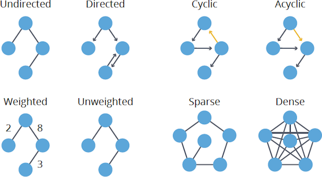
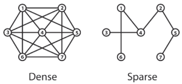
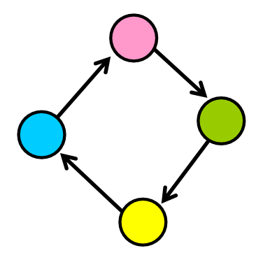
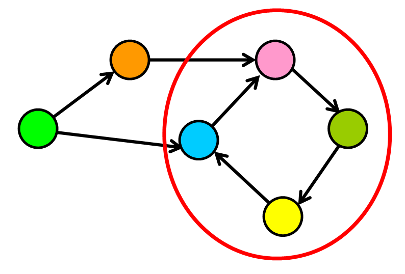

### Basics
- *Trees* are *graphs*.

### Terminology summary <small>([*ref*](https://www.freecodecamp.org/news/data-structures-101-graphs-a-visual-introduction-for-beginners-6d88f36ec768/))</small>
- *Nodes*: elements that create the network, they can represent *anything*
- *Edges*: the *connections* <small>(thick lines)</small> between the `nodes`, they can be either *directed* or *un-directed*
- *|V|*: total number of *nodes* <small>(vertices)</small> in the graph
- *|E|*: total number of *edges* <small>(connections)</small> in the graph

### Types of *Graphs*
- An overview of *types*
    > 
- DIRECTION
    - Directed Graphs
        - Graphs that have *arrows pointing to a specific direction*, **you cannot go back**.
        - For this type of graph, you might *not* able to return to your initial location at all.

    - Undirected Graphs
        - Graphs that don't have *arrows pointing in a specific direction* is assumed as *undirected*.
        - It also means that the *connections* are **two-way roads**.
- WEIGHT
    - Weighted Graphs
        - The value <small>(`weight`)</small> is used to represent a quantifiable relationship between the `nodes` they connect.

    - Unweighted Graphs
        - Well, graphs that do not have `weights` associated with their `edges`.
- DENSITY
    > 

### About *cycles*
- They are *paths* that **start and end at the same `node`**.
    >  
    > 

### References
- [*Data Structures 101: Graphs — A Visual Introduction for Beginners* by *Estefania Cassingena Navone*](https://www.freecodecamp.org/news/data-structures-101-graphs-a-visual-introduction-for-beginners-6d88f36ec768/)
- [*Graph Algorithms in Neo4j: Graph Algorithm Concepts* by *Mark Needham* & *Amy E. Hodler*](https://neo4j.com/blog/graph-algorithms-neo4j-graph-algorithm-concepts/)
